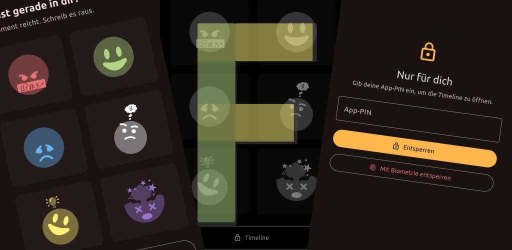

# filterlos.ich

Das In-App-Ventil für Ausraster, Geistesblitze und ungefilterte Gedanken.

`filterlos.ich` ist ein lokales Gedanken- und Emotionstagebuch. Das 2×3-Schnellerfassungsraster öffnet direkt den passenden Eintrag, damit ein Gedanke festgehalten werden kann, bevor er wieder verschwindet.



## Erste Version: umgesetzt

- 2×3-Schnellerfassung mit sechs festen Emotionskategorien
- Texteingabe mit Zeitstempel
- Bildanhänge und Audioaufnahmen; Anhänge werden gemeinsam mit den Einträgen verschlüsselt gespeichert
- Android-Diktat mit erzwungener On-Device-Erkennung, sofern das Gerät ein Offline-Sprachmodell bereitstellt
- Timeline mit PIN-Schutz, Emotionsfilter und Eintragslöschung
- optionale biometrische Entsperrung der Timeline auf Android; PIN bleibt verfügbar
- Stealth-Darstellung mit schwarzem Hintergrund und gedämpften Oberflächen
- UI-Settings: Schrift, Textgröße, Hell/Dunkel, Akzent- und Highlightfarbe, Emoji-Tasten
- optionaler lokaler `fi`-Companion mit manuell ausgewähltem GGUF-Modell
- manuell gestarteter Tagesrückblick und Fragen ans Tagebuch mit lokaler Stichwortauswahl
- verschlüsseltes, einsehbares und editierbares Nutzer-Memory; Aktualisierung nur auf ausdrücklichen Klick
- lokale Speicherung ohne Backend und ohne Cloud-Synchronisierung

## Emotionen und Kategorien

| Emoji | Kategorie | Einsatz |
| :---: | --- | --- |
| 😡 | Ausrast | Wut, Frust und Dampf ablassen |
| 😊 | Freude | Erfolge, Dankbarkeit und gute Momente |
| 😢 | Trauer | Sorgen, Enttäuschung und Melancholie |
| 😐 | Gedanke | Neutrale Notizen und Beobachtungen |
| 💡 | Geistesblitz | Ideen und Inspiration sichern |
| 🤯 | Chaos | Überforderung und Gedankenstrudel festhalten |

## Bedienablauf

1. Auf dem Startbildschirm eine der sechs Emotionen antippen.
2. Gedanken notieren, optional Bild anhängen oder Audio aufnehmen.
3. Unter Android kann zusätzlich lokale Spracherkennung verwendet werden. Sie wird mit `onDevice: true` angefordert; wenn kein Offline-Modell verfügbar ist, gibt es keinen Cloud-Fallback.
4. Den Eintrag sichern. Er wird verschlüsselt im lokalen Journal abgelegt.
5. Die Timeline über die App-PIN öffnen. Auf Android kann Biometrie zusätzlich aktiviert werden.

Die Schnellerfassung ist vom Timeline-Zugriff getrennt. Die PIN schützt die Timeline-Oberfläche; der AES-Datenschlüssel wird separat im Betriebssystem-Schlüsselbund gespeichert.

## Sicherheit und Datenschutz

- Einträge und Medien liegen in einer lokalen AES-256-GCM-verschlüsselten Datei.
- Der zufällige Datenschlüssel wird mit `flutter_secure_storage` im Android Keystore beziehungsweise im Linux Secret Service/Keyring abgelegt.
- Die Timeline-PIN wird nicht im Klartext gespeichert. Gespeichert wird ein gesalzener PBKDF2-HMAC-SHA256-Prüfwert.
- Nach fünf falschen PIN-Eingaben wird der Zugriff für 30 Sekunden verzögert.
- Unter Android kann `local_auth` Biometrie für die Timeline anbieten. Linux verwendet die App-PIN.
- Es gibt kein Backend, keine Cloud-Synchronisierung, kein Tracking und keine automatische Übertragung.
- GGUF-Modell-Dateien werden vom Nutzer ausgewählt und im App-Support-Ordner abgelegt. Sie sind Modellgewichte, keine Tagebuchdaten, und liegen nicht im AES-Journalcontainer.
- Der Stealth-Modus verändert die Darstellung, verhindert aber nicht Screenshots oder Einsicht durch Betriebssystem-/Gerätezugriff.
- On-Device-Spracherkennung hängt von den lokal installierten Betriebssystemdiensten und Sprachmodellen ab. Bei fehlender Offline-Unterstützung bleibt die manuelle Eingabe verfügbar.

Details stehen in [PRIVACY.md](PRIVACY.md).

## Lokale KI `fi`

Die optionale Inferenz läuft über `llm_llamacpp`/llama.cpp. Es wird kein Modell mit der App ausgeliefert und keines automatisch aus dem Internet geladen. Wähle in den Einstellungen eine GGUF-Datei, deren Quelle und Lizenz du geprüft hast. Die App kopiert sie lokal in den privaten Modellordner; der Import ist auf 4 GB begrenzt.

Bei importiertem Modell sind verfügbar:

- manuelle, kurze Resonanz-Antwort unter einem Tagebucheintrag
- Tagesrückblick auf Knopfdruck
- Fragen ans Tagebuch: lokal werden per Stichwortsuche bis zu sechs passende Einträge ausgewählt und als Kontext verwendet
- manuelle Aktualisierung eines kurzen Memory-Profils aus bis zu 30 Einträgen; das Profil kann in den Einstellungen gelesen, bearbeitet oder gelöscht werden

Es werden keine externen KI-APIs oder Cloudmodelle angesprochen. Die Tagebuchfrage nutzt derzeit lokale Stichwortauswahl, keine Vektor-Embeddings. Es gibt keine automatische Hintergrundanalyse.

Für Antworten muss ein zum Gerät passendes GGUF-Modell installiert sein. Die Inferenz kann langsam sein und viel Arbeitsspeicher benötigen. Der Nutzer ist für Modellquelle und Modelllizenz verantwortlich.

## Plattformen

- Android: Hauptziel; Biometrie und On-Device-Spracherkennung sind geräteabhängig.
- Linux Desktop: lokaler Betrieb mit PIN-Fallback. Biometrie und Speech-to-Text sind dort nicht aktiviert.

## Technik

- Flutter / Dart
- AES-256-GCM und PBKDF2-HMAC-SHA256 über `cryptography`
- Schlüsselablage über `flutter_secure_storage`
- lokaler App-Speicher über `path_provider`
- Medienauswahl über `file_picker`
- lokale Audioaufnahme über `record`
- On-Device-Spracherkennung über `speech_to_text`
- biometrische Android-Entsperrung über `local_auth`
- lokale GGUF-Inferenz über `llm_llamacpp` / llama.cpp

## Entwicklung

```bash
flutter pub get
flutter analyze
flutter test test/widget_test.dart --reporter compact
flutter build linux --debug
```

Linux benötigt GTK-Entwicklungsbibliotheken sowie Secret Service/libsecret für den System-Schlüsselbund. Android-Builds benötigen ein vollständiges JDK mit `javac`.

## Rechtliches

Der Source Code steht unter MIT-Lizenz. Name, Logo, Icons und sonstige Brand Assets sind separat geschützt. Drittanbieter-Lizenzen und Fonts sind in [THIRD_PARTY_LICENSES.md](THIRD_PARTY_LICENSES.md) dokumentiert.

## footnote

Developed with the kind support of Copilot
